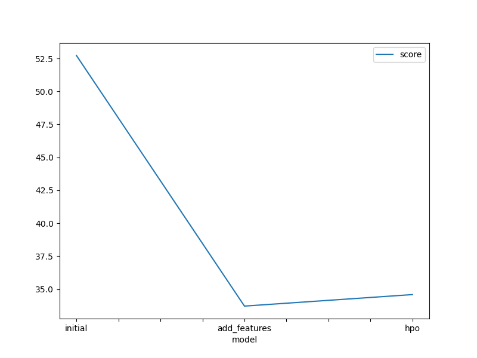
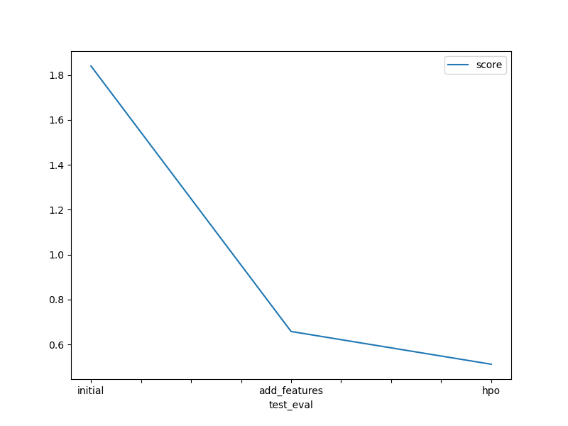

# Report: Predict Bike Sharing Demand with AutoGluon Solution
#### NAME HERE

## Initial Training
### What did you realize when you tried to submit your predictions? What changes were needed to the output of the predictor to submit your results?
To comply with Kaggle's submission requirements, which reject negative prediction values, all negative outputs were adjusted to 0

### What was the top ranked model that performed?
The highest-ranked model was the 'add_features' model (WeightedEnsemble_L3) achieving a validation RMSE score of 33.709616 and the best Kaggle score of 0.65798 on the test dataset.

## Exploratory data analysis and feature creation
### What did the exploratory analysis find and how did you add additional features?
I improved the dataset by breaking down the datetime into month, day, year, and hour parts. Also, I changed the season and weather features into categories to make them easier to understand and use in the analysis.

### How much better did your model preform after adding additional features and why do you think that is?
After adding features, the model's performance on the Kaggle score improved by around 64.19%. This improvement came from breaking down the datetime feature into smaller parts like year, month, day, and hour. These additional features helped the model better understand patterns over time, like seasonal trends or historical patterns in the data.

## Hyper parameter tuning
### How much better did your model preform after trying different hyper parameters?
After adjusting the hyperparameters, a small improvement has been observed in the Kaggle score

### If you were given more time with this dataset, where do you think you would spend more time?
I'd dedicate more time to feature engineering and hyperparameter tuning in the future, as both are crucial processes for constructing an effective model.

### Create a table with the models you ran, the hyperparameters modified, and the kaggle score.
| model         | hpo1                                              | hpo2                                                  | hpo3                                                       | hpo4                                                             | hpo5                   | hpo6                                                             | hpo7                                                        | hpo8                       | score  |
|---------------|---------------------------------------------------|-------------------------------------------------------|------------------------------------------------------------|------------------------------------------------------------------|------------------------|------------------------------------------------------------------|-------------------------------------------------------------|----------------------------|--------|
| initial       | default                                           | default                                               | default                                                    | default                                                          | default                | default                                                          | default                                                     | default                    | 1.84007|
| add_features  | default                                           | default                                               | default                                                    | default                                                          | default                | default                                                          | default                                                     | default                    | 0.65798|
| hpo           | NN: dropout_prob: 0.0, 0.5                        | NN: num_epochs: 5                                     | NN: learning_rate: ag.space.Real(1e-4, 1e-2)               | NN: activation: ag.space.Categorical(relu, softrelu, tanh)        | GBM: extra_trees: True | GBM: num_boost_round: ag.space.Int(lower=100, upper=500, default=100) | GBM: num_leaves: ag.space.Int(lower=25, upper=64, default=36) | GBM: ag_args: {name_suffix: XT} | 0.51211|

### Create a line plot showing the top model score for the three (or more) training runs during the project.

### Create a line plot showing the top kaggle score for the three (or more) prediction submissions during the project.

## Summary

In this project, I put into practice all the concepts covered in this section of the course. I started with exploratory data analysis, then expanded the dataset with new features. After that, I built a regression model using machine learning techniques, leveraging the Autogluon framework and fine-tuning the hyperparameters. Finally, I uploaded the results onto Kaggle.
